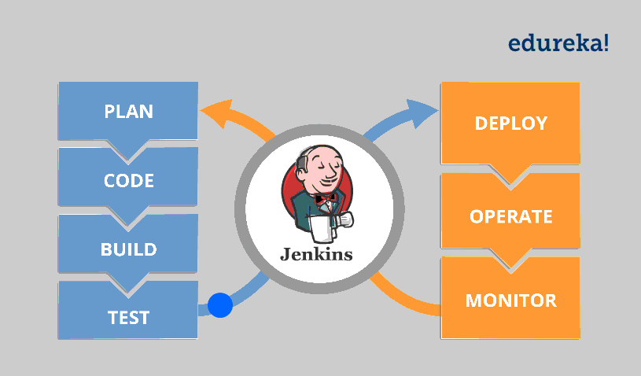

<h1 align="center">🚀 DevOps CI/CD Project</h1>

    

## 📖 Overview

Welcome to the **DevOps CI/CD pipeline** project! 🎉 This awesome setup automates the process of building, testing, and deploying applications faster than you can say "Continuous Integration!" It utilizes **Docker**, **Maven**, **SonarQube**, and **Nexus** to ensure a smooth workflow from development to production. 

### 🛠 Tools Used

- **Docker** 🐳: Containerization platform for packaging applications. (No more "it works on my machine" excuses!)
- **Maven** 📦: Project management and comprehension tool. 
- **SonarQube** 📊: Continuous inspection tool for code quality. 
- **Nexus** 📦: Repository manager for storing artifacts. 
- **Jenkins** 🤖: Automation server for continuous integration and delivery. 
- **Git** 🌐: Version control system for tracking code changes. 

## 🔄 CI/CD Pipeline Stages

1. **Checkout Code** 📝: Pulls the latest code from the repository. 
2. **Build** 🏗️: Compiles the application using Maven. 
3. **Run Tests** 🧪: Executes unit tests to ensure code quality. 
4. **SonarQube Analysis** 📈: Analyzes the code for quality and vulnerabilities.
5. **Build Docker Image** 🖼️: Creates a Docker image of the application. 
6. **Push Docker Image** ⬆️: Pushes the Docker image to a Docker registry. 
7. **Deploy** 🚀: Deploys the application using Docker Compose.
## ⚙️ Getting Started

### Prerequisites

- Docker and Docker Compose installed on your machine. 
- Maven installed for Java projects.
- A running instance of SonarQube and Nexus. 

## 📦 Usage

- Ensure all dependencies are defined in the `pom.xml` file. 
- Add your application code in the appropriate directory. 
- Monitor the CI/CD pipeline for build and deployment status. (Grab your popcorn; it’s showtime!)

## 🧩 Contributing

We welcome contributions! fork the repository and submit a pull request.

## 📞 Contact

For any inquiries or issues, please contact:

- **Rami Laribi**: laribi.rami@esprit.tn

---

**✨ Remember:** Great things in business are never done by one person; they’re done by a team of people. Let's build something amazing together! 🎉
