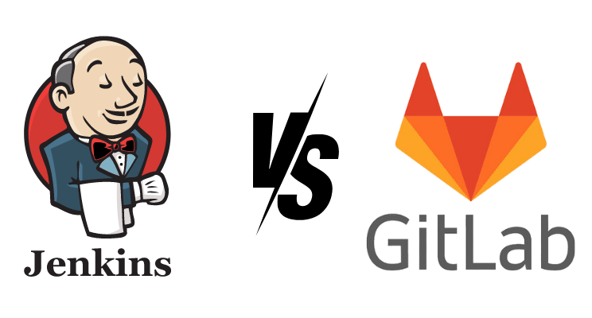

<h1 align="center">🚀 DevOps CI/CD Project</h1>

    

## 📖 Overview

Welcome to the **DevOps CI/CD pipeline** project! 🎉 This awesome setup automates the process of building, testing, and deploying applications faster than you can say "Continuous Integration!" It utilizes **Docker**, **Maven**, **SonarQube**, and **Nexus** to ensure a smooth workflow from development to production.

### 🛠 Tools Used

- **Docker** 🐳: Containerization platform for packaging applications. (No more "it works on my machine" excuses!)
- **Maven** 📦: Project management and comprehension tool.
- **SonarQube** 📊: Continuous inspection tool for code quality.
- **Nexus** 📦: Repository manager for storing artifacts.
- **GitLab CI** 🧑‍💻: Continuous integration and deployment server embedded within GitLab repositories.
- **Git** 🌐: Version control system for tracking code changes.

## 🔄 CI/CD Pipeline Stages

1. **Checkout Code** 📝: Pulls the latest code from the repository.
2. **Build** 🏗️: Compiles the application using Maven.
3. **Run Tests** 🧪: Executes unit tests to ensure code quality.
4. **SonarQube Analysis** 📈: Analyzes the code for quality and vulnerabilities.
5. **Build Docker Image** 🖼️: Creates a Docker image of the application.
6. **Push Docker Image** ⬆️: Pushes the Docker image to a Docker registry.
7. **Deploy** 🚀: Deploys the application using Docker Compose.

## ⚙️ Getting Started

### Prerequisites

- Docker and Docker Compose installed on your machine.
- Maven installed for Java projects.
- A running instance of SonarQube and Nexus.

## 📦 Usage

- Ensure all dependencies are defined in the `pom.xml` file.
- Add your application code in the appropriate directory.
- Monitor the CI/CD pipeline for build and deployment status. (Grab your popcorn; it’s showtime!)

## 📝 GitLab CI Overview

**GitLab CI** is an integrated CI/CD solution within the GitLab platform, enabling seamless setup and automation of pipelines without additional server installations. By defining the pipeline in a `.gitlab-ci.yml` file, GitLab CI ensures streamlined and efficient integration for projects hosted on GitLab, allowing for rapid feedback and deployment. The GitLab CI configuration for this project includes the following stages:

1. **Check**: Verifies Java and Maven versions to ensure compatibility.
2. **Build**: Uses Maven to compile the project and package it for deployment.
3. **Test**: Runs unit tests to maintain code quality and reliability.
4. **Report**: Generates a JaCoCo coverage report for a visual representation of test coverage.
5. **Sonar**: Conducts a SonarQube analysis to inspect code quality and identify vulnerabilities.
6. **Deploy**: Builds a Docker image and pushes it to the Docker registry for deployment.
7. **Start Services**: Leverages Docker Compose to launch services for the application, ensuring a consistent deployment environment.

Each stage is clearly defined in the `.gitlab-ci.yml` file, making the pipeline easy to read, maintain, and update. GitLab CI provides automated runners to execute jobs, with options for private and shared runners depending on specific project requirements.

## 🔄 Comparison: GitLab CI vs Jenkins

In this project, both **GitLab CI** and **Jenkins** are used to implement CI/CD, each with its unique advantages. Here’s a comparison to showcase their strengths:

| Feature                          | GitLab CI                                            | Jenkins                                              |
|----------------------------------|------------------------------------------------------|------------------------------------------------------|
| **Integration**                  | Built-in to GitLab; seamless integration with GitLab repositories | Requires manual setup; can integrate with various SCM tools (GitHub, Bitbucket, etc.) |
| **Setup Complexity**             | Simple setup with GitLab runners; integrated with GitLab | Requires setting up Jenkins server and configuring agents for distributed builds |
| **Pipeline as Code**             | Uses `.gitlab-ci.yml` file directly in the repository | Uses Jenkinsfile within the repository or configured through the UI |
| **Runner Management**            | GitLab runners are managed within GitLab; can use shared or private runners | Jenkins agents (nodes) need manual setup and management; offers more flexibility |
| **UI/UX**                        | Modern and easy-to-navigate interface; integrated within GitLab | Highly customizable UI with plugins; extensive plugin ecosystem |
| **Cost**                         | Free for public repos; may have cost for private runners on self-hosted instances | Open-source; additional cost for plugins and enterprise support |
| **Plugins and Extensions**       | Limited plugins; GitLab CI is more streamlined | Large plugin ecosystem; allows for extensive customization and flexibility |
| **Monitoring and Logs**          | Real-time job logs accessible within GitLab CI/CD interface | Extensive logging and monitoring; plugins can provide additional insights |
| **Docker Support**               | Built-in Docker support; GitLab provides Docker-in-Docker (DinD) for CI/CD | Strong Docker support; more control over Docker version and setup |
| **Performance**                  | Highly efficient with GitLab's own runners; designed for GitLab environment | May require tuning based on server setup; can be as fast but needs more resources |
| **Pipeline Triggering Options**  | Automatically triggered by push, merge requests, or schedule; supports manual and conditional jobs | Supports triggers through webhooks, scheduled builds, and more |
| **Community and Support**        | Strong GitLab community; official support available | Large open-source community; enterprise support available with Jenkins X |

Using **both GitLab CI** and **Jenkins** brings the benefits of an integrated GitLab experience as well as the customization and flexibility of Jenkins. This dual approach enhances pipeline versatility, making it adaptable to different project requirements.

---

**✨ Remember:** Great things in business are never done by one person; they’re done by a team of people. Let's build something amazing together! 🎉
